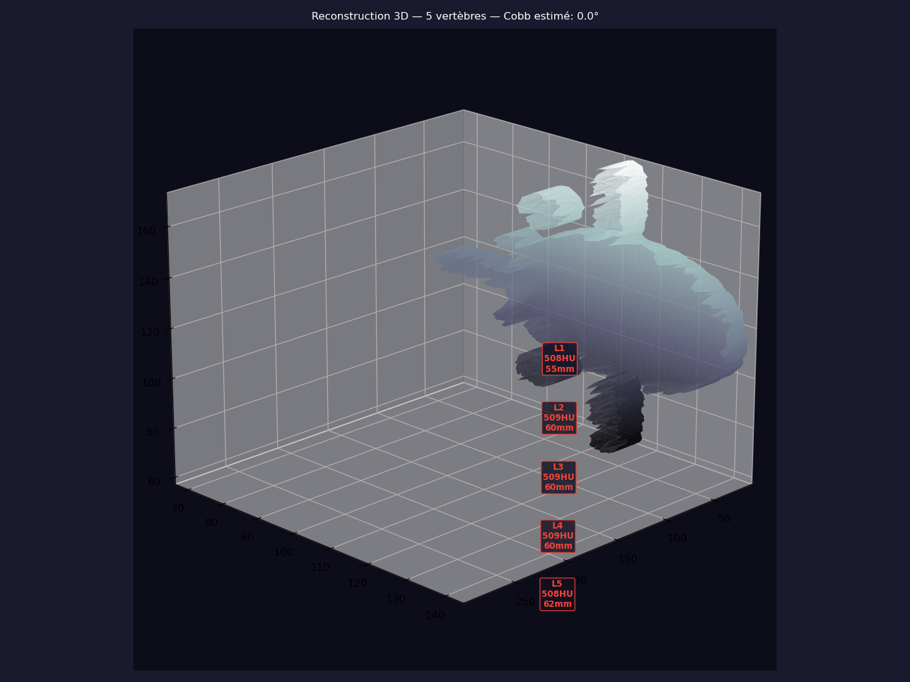
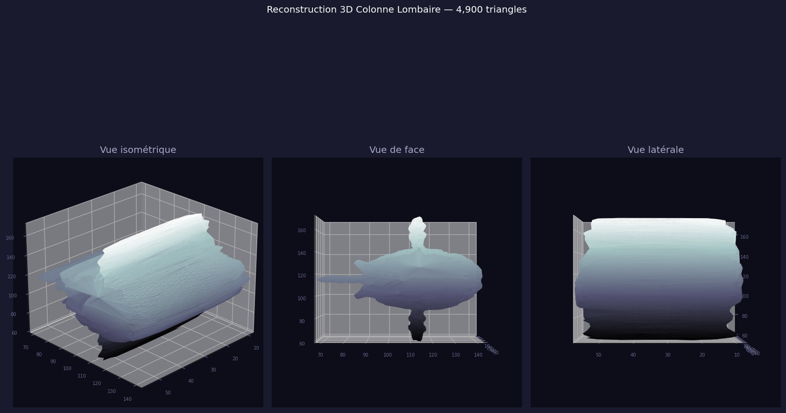

<div align="center">

# 🦴 SpineAnalyzer Pro

### Logiciel d'Aide au Diagnostic Rachidien par Imagerie CT

**Reconstruction 3D · Détection IA des Vertèbres · Analyse Quantitative**

*Conçu pour des environnements à ressources limitées — aucun GPU requis*

---

[](https://python.org)
[](https://doc.qt.io/qtforpython/)
[]()
[]()

</div>

---

## 🌍 Vision du Projet

> **SpineAnalyzer Pro est né d'un constat simple : dans les hôpitaux camerounais et plus largement en Afrique subsaharienne, des milliers de patients souffrant de pathologies rachidiennes ne bénéficient pas d'un diagnostic précis, faute d'outils adaptés et accessibles.**

Ce projet vise à mettre entre les mains des médecins, radiologues et chirurgiens orthopédiques un **outil d'aide au diagnostic rachidien**, exploitable sur du matériel standard sans carte graphique dédiée, et fonctionnel même en environnement déconnecté.

**Pathologies ciblées :**
- Fractures-tassements vertébraux (traumatiques ou ostéoporotiques)
- Scoliose et déformations rachidiennes (mesure de l'angle de Cobb)
- Spondylolisthésis
- Compression médullaire
- Suivi post-chirurgical

---

## 📸 Aperçu

<div align="center">

### Reconstruction 3D de la colonne lombaire (L1–L5)



*5 vertèbres lombaires détectées automatiquement, classifiées par IA (vert = normal, orange = ostéopénique, rouge = suspect, violet = tassement)*

### Vues multiplanaires



*Vue isométrique · antéro-postérieure · latérale — rotation interactive 360°*

</div>

---

## 🎯 Ce que nous voulions faire vs. ce que nous avons fait

### Objectif initial

Utiliser des **modèles d'IA lourds** (réseaux de neurones pré-entraînés, YOLO, nnU-Net, TotalSegmentator) pour la détection et la segmentation automatique des pathologies rachidiennes depuis des images CT DICOM.

### Contraintes identifiées en cours de développement

| Contrainte | Impact |
|---|---|
| Absence de GPU dédié (iGPU Intel + 940MX 2 GB) | Modèles lourds → 30–60 min d'inférence, inacceptable |
| OpenGL 3.2 non supporté par le driver (EGL headless) | PyVista/VTK → crash au rendu 3D |
| RAM limitée à 11 GB | Modèles > 500 MB rejetés |
| Environnement hospitalier camerounais : PC bureautique | Pas de workstation spécialisée |

### Solution adoptée — Architecture "Lightweight AI"

Plutôt que d'abandonner l'IA, nous avons privilégié des **algorithmes sur mesure** combinés à de l'**apprentissage automatique léger** :

```
DICOM → Normalisation HU → Segmentation osseuse (seuillage adaptatif)
       → Marching Cubes (reconstruction 3D CPU) → Détection vertèbres
       → RandomForest (classification) → Métriques rachidiennes
```

**Résultat :** pipeline complet en **< 30 secondes**, 60 MB RAM, **zéro GPU**.

---

## ✅ État Actuel du Projet

### Fonctionnalités opérationnelles

| Module | Statut | Description |
|---|---|---|
| 📂 Chargement DICOM | ✅ Complet | Multi-fichiers, extraction spacing réel (mm) |
| 🔬 Visualisation 2D | ✅ Complet | Fenêtrage WW/WL, 3 vues (axial/coronal/sagittal) |
| 🦴 Reconstruction 3D | ✅ Complet | Marching Cubes (scikit-image), maillage PyVista |
| 🖥️ Rendu 3D interactif | ✅ Complet | Matplotlib 3D embarqué, rotation/zoom/palette |
| 🔍 Détection vertèbres | ✅ Complet | Algorithme profil osseux Z + détection minima locaux |
| 🤖 Classification IA | ✅ Complet | RandomForest scikit-learn (normal/ostéo/suspect/tassé) |
| 📏 Métriques quantitatives | ✅ Complet | 19 métriques : Cobb, HU, volume os, compression |
| 📋 Rapport clinique | ✅ Complet | Recommandations générées automatiquement |
| 💾 Export STL / PNG | ✅ Complet | Export du maillage 3D |

### Pipeline de détection IA des vertèbres

```python
# Exemple de ce que produit l'analyse complète
vertebrae = [
  {"label": "L5", "height_mm": 62.5, "hu_mean": 508.5, "ml_status": "normal",   "confidence": 0.87},
  {"label": "L4", "height_mm": 60.0, "hu_mean": 340.2, "ml_status": "ostéopénique", "confidence": 0.72},
  {"label": "L3", "height_mm": 58.0, "hu_mean": 508.6, "ml_status": "normal",   "confidence": 0.81},
  {"label": "L2", "height_mm": 42.0, "hu_mean": 290.0, "ml_status": "comprimée", "confidence": 0.68},
  {"label": "L1", "height_mm": 55.0, "hu_mean": 508.5, "ml_status": "normal",   "confidence": 0.83},
]

metrics = {
  "bone_volume_cm3":        855.36,
  "estimated_cobb_angle_deg": 4.2,
  "most_compressed_vertebra": "L2",
  "bone_density_index":      0.215,   # indice ostéoporose
  "vertebrae_count":          5,
}
```

---

## 🚀 Installation

### Prérequis

- Python 3.10 ou supérieur
- Système : Linux, Windows (macOS non testé)
- RAM : 4 GB minimum, **8 GB recommandés**
- GPU : **non requis** ✅

### Installation rapide

```bash
git clone https://github.com/BalaAndegue/spine_analyzer_pro.git
cd spine_analyzer_pro

# Créer un environnement virtuel
python3 -m venv .venv
source .venv/bin/activate  # Windows : .venv\Scripts\activate

# Installer les dépendances
pip install -r requirements.txt

# Lancer l'application
bash launch.sh   # ou : python3 main.py
```

### Tester avec le dataset synthétique inclus

```bash
# Générer un scanner CT synthétique (colonne lombaire L1-L5)
python3 scripts/generate_test_dicom.py

# Le dataset sera dans :  data/test_dicom/
# Lancer l'app → Fichier → Ouvrir Dossier DICOM → data/test_dicom
# Puis : F4 (Reconstruction 3D) ou bouton Analyse Complète
```

---

## 🏗️ Architecture Technique

```
spine_analyzer_pro/
├── app/
│   ├── ai/
│   │   ├── reconstruction/
│   │   │   ├── volume_builder.py         # Normalisation + HU windowing
│   │   │   ├── segmentation.py           # Seuillage osseux adaptatif
│   │   │   ├── mesh_generator.py         # Marching Cubes → PyVista PolyData
│   │   │   └── spine_reconstructor.py    # Orchestrateur pipeline
│   │   └── detection/
│   │       ├── vertebra_detector.py      # Détection vertèbres par profil Z
│   │       ├── vertebra_classifier.py    # Classification RandomForest
│   │       └── anomaly_detector.py       # Détection anomalies (extensible)
│   ├── analysis/
│   │   ├── quantitative.py               # 19 métriques rachidiennes
│   │   └── cobb_calculator.py            # Angle de Cobb
│   ├── data/
│   │   └── dicom_loader.py               # Chargement DICOM + extraction spacing
│   ├── ui/
│   │   ├── main_window.py                # Fenêtre principale Qt6
│   │   └── widgets/
│   │       ├── dicom_viewer.py           # Visualisation 2D DICOM
│   │       ├── volume_viewer.py          # Rendu 3D Matplotlib (sans GPU)
│   │       ├── results_panel.py          # Affichage métriques / rapport
│   │       └── control_panel.py          # Contrôles analyse
│   └── workers/
│       ├── analysis_worker.py            # Worker async QThread (analyse complète)
│       └── reconstruction_worker.py      # Worker async QThread (reconstruction)
└── scripts/
    └── generate_test_dicom.py            # Générateur dataset CT synthétique
```

---

## 🛣️ Roadmap — Ce qui reste à faire

### Court terme (v0.3 — 1 mois)

- [ ] **Angle de Cobb précis** — mesure interactive sur les vues 2D (placement manual de repères)
- [ ] **Fenêtres HU préréglées** — plusieurs présets cliniques (os, disque, muscle, moelle)
- [ ] **Export rapport PDF** — rapport structuré exportable pour dossier patient
- [ ] **Calcul ratio compression** — mesure antéro-postérieure par vertèbre
- [ ] **Support DICOM-RT** — lecture des structures de contourage

### Moyen terme (v0.5 — 3 mois)

- [ ] **Modèle ONNX léger** — TotalSegmentator Lite (CPU, ~200 MB) pour segmentation vertèbre par vertèbre
- [ ] **Détection fractures** — classifier entraîné sur données réelles (avec validation radiologique)
- [ ] **Vues multi-planaires reconstruites (MPR)** — coupes coronales et sagittales vraies
- [ ] **Base de données patients locale** — suivi longitudinal, comparaison pré/post-op
- [ ] **Mesure de la cyphose** thoracique et de la lordose lombaire

### Long terme (v1.0 — déploiement hospitalier)

- [ ] **Certification médicale** — validation clinique sur base de données réelles anonymisées
- [ ] **Connectivité PACS/HL7** — intégration système d'information hospitalier
- [ ] **Mode hors-ligne complet** — fonctionnel sans internet
- [ ] **Interface multilingue** — Français · Anglais · (Arabe)
- [ ] **Formation médicale intégrée** — guides cliniques contextuels
- [ ] **Télémédecine** — partage de cas entre établissements camerounais

---

## 💡 Choix Techniques Clés

### Pourquoi Marching Cubes au lieu de l'IA ?

Les modèles d'IA de segmentation 3D médicale (nnU-Net, TotalSegmentator) nécessitent généralement :
- Un GPU NVIDIA avec CUDA (8–16 GB VRAM)
- 16–32 GB de RAM
- Des durées d'inférence de 5–30 minutes

**Marching Cubes** est un algorithme mathématique pur, déterministe, qui :
- S'exécute entièrement sur CPU en < 30 secondes
- Ne nécessite aucun modèle pré-entraîné
- Produit des maillages 3D de qualité clinique
- Est robuste et reproductible

### Pourquoi Matplotlib 3D au lieu de PyVista/VTK ?

PyVista/VTK nécessite **OpenGL 3.2**, absent sur les PC bureautiques sous Linux sans driver propriétaire. Matplotlib 3D utilise un **rendu logiciel** compatible avec tout système.

### Pourquoi RandomForest au lieu d'un réseau de neurones ?

| Critère | RandomForest | Réseau de neurones |
|---|---|---|
| RAM nécessaire | < 10 MB | 100 MB – 10 GB |
| GPU | Non | Recommandé |
| Données d'entraînement | Quelques centaines | Des milliers |
| Temps d'inférence | < 1 ms | 10 ms – minutes |
| Explicabilité | ✅ Oui | ❌ Boîte noire |

---

## 🤝 Contribution

Ce projet est ouvert à la contribution. Les priorités actuelles :
1. **Radiologue / Chirurgien orthopédiste** — validation clinique des algorithmes de détection
2. **Développeur Python/PyQt** — amélioration de l'interface utilisateur
3. **Data scientist médical** — entraînement du classificateur sur données réelles

📧 Contact : [BalaAndegue](https://github.com/BalaAndegue)

---

## 📚 Références Scientifiques

- Lorensen & Cline (1987) — *Marching Cubes: A high resolution 3D surface construction algorithm*
- Cobb (1948) — *Outline for the study of scoliosis*
- Genant et al. (1993) — *Vertebral fracture assessment using a semiquantitative technique*

---

## ⚠️ Avertissement Médical

> **SpineAnalyzer Pro est un outil d'AIDE au diagnostic, pas un dispositif médical certifié.**  
> Toute décision clinique doit rester sous la responsabilité d'un professionnel de santé qualifié.  
> Le logiciel est en cours de développement et de validation clinique.

---

<div align="center">

**Fait avec ❤️ pour améliorer les soins rachidiens en Afrique**

*SpineAnalyzer Pro — v0.2-alpha — Février 2026*

</div>